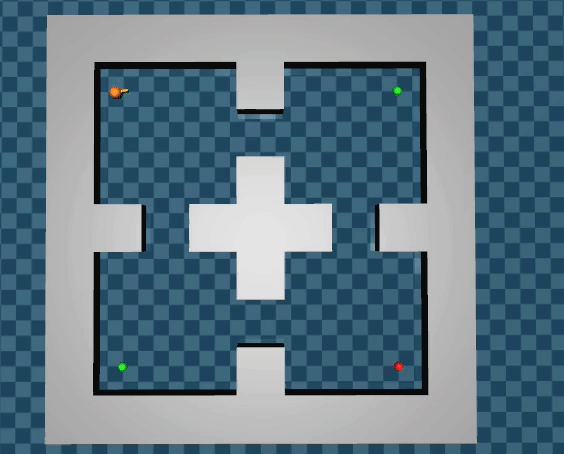

# Code release accompanying 'Diverse Exploration via InfoMax Options'

Arxiv link: https://arxiv.org/abs/2010.02756

## Requirements

- Python 3.6.1 or newer
- (Optional) [MuJoCo] 2.0.0
- Linux
  - We ran all experiments on Ubuntu18.04. Arch Linux is also used for testing.
  - Can also work on macOS and Windows, but we haven't tested them.

## Dependencies

- Depends on [PyTorch] 1.5.0, [Rainy] 0.8.0 (for A2C, AOC, PPO, and PPOC implementation),
  [rlpy3] 2.0.0 (for Gridworld).
  - We also used PyTorch 1.6.0 for testing so it may also work.
- Optionally dependes on [mujoco-maze] 0.1.1 (for MuJoCo experiments).
- You can install dependencies by `pip3 install -r -requirements.txt`
  and (if you have MuJoCo installed) `pip3 install -r -requirements-mujoco.txt`.
- Or, if you use [poetry], you can install all dependencies via `poetry install`.

## Important files

Some important files here:
- `src/a2imoc.py`: Implementation of A2IMOC
- `src/ppimoc.py`: Implementation of PPIMOC
- `src/run_4room.py`: CLI app for running Gridworld experiments
- `src/run_mujoco.py`: CLI app for running MuJoCo PointMaze experiments

Note that these files are not a 'package' and not installable

## Train agents

Here is a list of commands that we used for experiments:

- `python src/run_4rooms.py --envname=4RoomsExp --agent-name=a2imoc --eval-times=4 train`
  - For Gridworld four rooms experiments.
  - To use other algorithm, replace a2imoc with `aoc/our-aoc/a2c`.
- `python src/run_mjmaze.py --envname=Point4Rooms-v2 --logmu-weight-min=0.0 --eval-times=8 -SN --agent-name=ppimoc train`
  - For MuJoCo Point Four Rooms experiments.
  - To use other algorithm, replace ppimoc with `ppoc/our-ppoc/ppo`.
- `python src/run_mjmaze.py --envname=PointBilliard-v2 --eval-times=8 -SN --logmu-weight-min=0.0 --max-steps=1 --beta-logit-clip=0.05 --agent-name=ppimoc train-and-adapt PointBilliard2/PointBilliard3/PointBilliard4`
  - For MuJoCo Point Billiard experiments.
  - Also, `ppoc/our-ppoc/ppo` are supported.

To enable visualization (only for evaluation run), one can use `-VB` and `--eval-render` options.
E.g.,
- `python src/run_4rooms.py --envname=4RoomsExp --agent-name=a2imoc -VB train --eval-render`
- `python src/run_mjmaze.py --envname=Point4Rooms-v2 --logmu-weight-min=0.0 -VB -VP -SN --agent-name=ppimoc train --eval-render`

Then you can view all visualizations.

## Watch learned agents work

This repository also contains some trained models under `trained-models` directory.
To watch them, `eval` subcommand works.

E.g., with
`python src/run_mjmaze.py --envname=Point4Rooms-v2 --agent-name=ppimoc -VB -VP -SN --eval-times=20 eval trained-models/ppimoc-mujoco-four-rooms.pth --render`,
you get:

[MuJoCo]: http://mujoco.org/
[mujoco-maze]: https://github.com/kngwyu/mujoco-maze
[poetry]: https://python-poetry.org/
[PyTorch]: https://pytorch.org/
[Rainy]: https://github.com/kngwyu/Rainy
[rlpy3]: https://github.com/kngwyu/rlpy3

